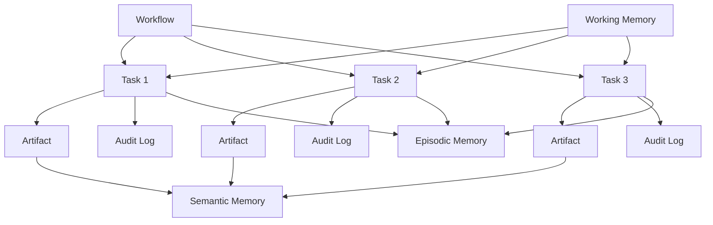

# Initial Data Model – Python AI Assistant

*Based on [[PRD – Python AI Assistant v1]] and research notes. Logical model only – no SQL syntax.*

## Core Entities & Responsibilities

### Workflows
- **Purpose:** Represent long-running, multi-step research or synthesis processes
- **Responsibilities:**
  - Maintain overall task state and progress
  - Coordinate subtask execution order and dependencies
  - Store checkpoint data for crash recovery
  - Track execution time and resource usage
  - Manage retry logic and failure handling
- **Key attributes:** ID, type, status, priority, current step, parameters, metadata

### Tasks
- **Purpose:** Individual units of work within a workflow
- **Responsibilities:**
  - Execute specific actions (web search, document reading, analysis)
  - Store input parameters and output results
  - Track execution attempts and outcomes
  - Maintain relationships to parent workflow and sibling tasks
- **Key attributes:** ID, workflow ID, type, status, input data, output data, error details

### Artifacts
- **Purpose:** Generated outputs and intermediate results
- **Responsibilities:**
  - Store documents, reports, notes, and synthesized content
  - Maintain version history and evolution
  - Link to source materials and generation context
  - Track quality metrics and confidence scores
- **Key attributes:** ID, type, content, format, version, source references, metadata

### Memory Entities

#### Working Memory
- **Purpose:** Temporary context for active reasoning sessions
- **Responsibilities:**
  - Store session-specific conversation context
  - Cache frequently accessed data
  - Maintain rate limiting counters
  - Hold temporary calculations and intermediate results
- **Characteristics:** Ephemeral, high-speed access, time-limited retention

#### Episodic Memory
- **Purpose:** Chronological record of actions and decisions
- **Responsibilities:**
  - Log all tool executions and outcomes
  - Track decision chains with timestamps
  - Store user interactions and assistant responses
  - Maintain action sequences for replay and analysis
- **Characteristics:** Append-only, time-ordered, immutable after creation

#### Semantic Memory
- **Purpose:** Long-term knowledge and learned patterns
- **Responsibilities:**
  - Store vector embeddings of concepts and content
  - Maintain relationships between ideas
  - Support similarity search and pattern matching
  - Track confidence and provenance of learned information
- **Characteristics:** Durable, searchable, versioned, with metadata

### Audit Logs
- **Purpose:** Immutable record for transparency and compliance
- **Responsibilities:**
  - Record all system actions with full context
  - Track user permissions and consent
  - Log tool execution attempts and outcomes
  - Maintain cryptographic integrity of records
- **Key attributes:** Timestamp, actor, action type, before/after state, context, hash

## Entity Relationships

*Workflows contain multiple Tasks. Tasks produce Artifacts and generate Audit Logs. Artifacts feed into Semantic Memory. Tasks interact with Episodic and Working Memory. All entities reference Audit Logs for traceability.*

## Transactional Requirements

**Must be transactional (ACID properties):**
- Workflow state transitions (starting → running → completed/failed)
- Task assignment and completion
- Audit log creation (immutable append)
- User permission checks and updates
- Critical configuration changes

**Transactional boundaries:**
1. Workflow checkpoint creation
2. Task result persistence
3. Audit log entry creation
4. Permission validation and enforcement
5. Artifact version creation

## Immutability Requirements

**Must be immutable (append-only, never modified):**
- Audit log entries
- Episodic memory records
- Decision logs with reasoning chains
- Tool execution attempts and outcomes
- User consent records
- Source data references

**Immutable data characteristics:**
- Cryptographic hashing for integrity verification
- Timestamped with nanosecond precision
- Linked to previous entries for chain of custody
- Signed by executing component
- Stored in append-only data structures

## Ephemeral Data

**May be ephemeral (can be lost/regenerated):**
- Working memory session context
- Cached LLM responses
- Temporary calculation results
- Rate limiting counters
- In-progress user interface state
- Web search result caches (with TTL)

**Ephemeral data handling:**
- Time-to-live (TTL) expiration
- Regeneratable from source data
- Not required for audit or compliance
- Performance optimization only
- Can be purged without system impact

## Vector Embeddings – Logical Role

**Where embeddings fit in the architecture:**

### Semantic Memory Layer
- **Content embeddings:** Vector representations of documents, notes, research findings
- **Concept embeddings:** Abstract representations of ideas and relationships
- **Query embeddings:** Search intent representations for retrieval

### Retrieval Augmented Generation (RAG)
- **Context retrieval:** Finding relevant past work for current tasks
- **Pattern matching:** Identifying similar problems and solutions
- **Knowledge synthesis:** Connecting disparate information sources

### Similarity & Relationship Management
- **Semantic search:** Finding content by meaning rather than keywords
- **Cluster analysis:** Grouping related concepts and artifacts
- **Recommendation:** Suggesting relevant next steps or related research

### Embedding Metadata (Stored with vectors)
- Source document reference
- Generation timestamp and model version
- Confidence score and quality metrics
- Access permissions and visibility
- Version history and updates

## Data Lifecycle Management

### Creation Phase
- Workflows created from user requests or scheduled jobs
- Tasks instantiated with specific parameters
- Artifacts generated from task execution
- Memory entries created from processed information
- Audit logs appended for all actions

### Active Phase
- Workflow state updated as tasks progress
- Tasks execute and produce results
- Artifacts versioned and refined
- Memory accessed and updated
- Audit trail continuously extended

### Archive Phase
- Completed workflows marked as archived
- Artifacts moved to long-term storage
- Memory entries consolidated and optimized
- Audit logs compressed and indexed
- Ephemeral data purged

### Retention Policies
- **Short-term (30 days):** Working memory, task execution details
- **Medium-term (1 year):** Completed workflows, task results
- **Long-term (7 years):** Audit logs, user consent records
- **Permanent:** Critical configuration, cryptographic keys

## Data Quality & Integrity

### Validation Rules
- Workflow parameters must match allowed types
- Task dependencies must form acyclic graphs
- Artifact references must exist and be accessible
- Memory entries must have proper context
- Audit logs must be sequentially ordered

### Consistency Guarantees
- Referential integrity between related entities
- Temporal consistency in event ordering
- Semantic consistency in memory representations
- Version consistency in artifact evolution
- Permission consistency across all accesses

## Next Steps

1. **Design physical database schemas** based on this logical model
2. **Define API contracts** for entity creation and manipulation
3. **Implement data migration strategies** for schema evolution
4. **Create backup and restore procedures** for each data type
5. **Design data validation and sanitization pipelines**

---
*This model evolves from [[PRD – Python AI Assistant v1]] requirements and informs the [[Runtime Architecture – Python AI Assistant]]. For implementation details, see [[Database Schema – Python AI Assistant]].*